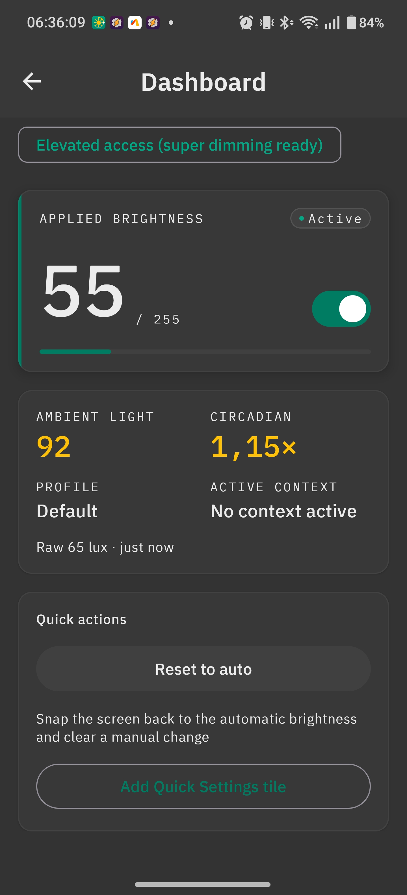
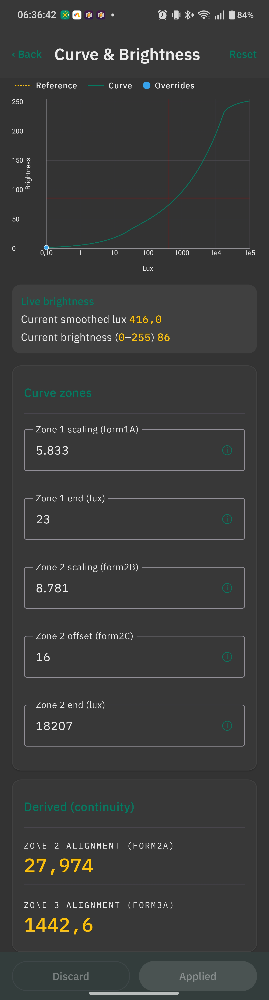
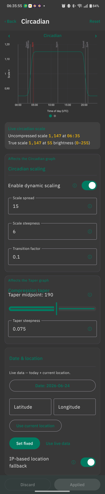
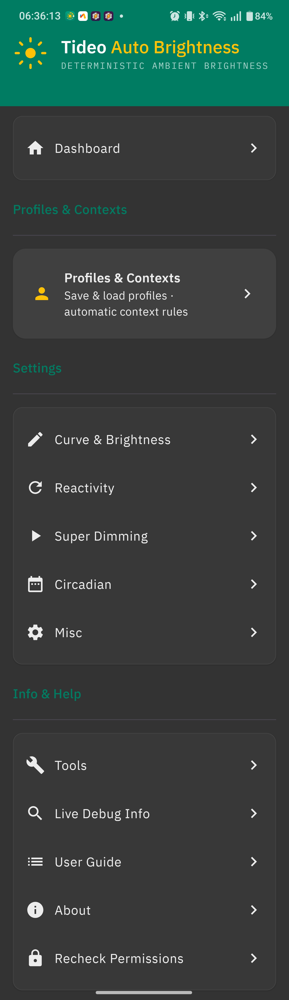

# Tideo Auto Brightness

[](https://github.com/faded-penguin021/tideo-auto-brightness/actions/workflows/build.yml)
[](https://github.com/faded-penguin021/tideo-auto-brightness/releases)
[](https://github.com/faded-penguin021/tideo-auto-brightness/releases)
[](https://github.com/faded-penguin021/tideo-auto-brightness/stargazers)
[](LICENSE)
[](https://developer.android.com/about/versions/12)
[](https://kotlinlang.org)

**A glass-box replacement for Android's adaptive brightness.** You taught Android your brightness
preferences and it is *still* wrong. Tideo replaces the opaque on-device machine learning with deterministic,
inspectable math: a tunable lux-to-brightness curve you can see and shape, smooth animated transitions,
circadian (time-of-day) scaling, per-context overrides, and an optional privileged super dimming
mode that allows the screen to go below the system minimum.

Tideo is a ground-up Kotlin/Compose rebuild of the **[Advanced Auto Brightness][aab]** (AAB) Tasker
project, ported to a native app with exact behavioural parity. The math and
decision logic are golden-tested against a transcription of the original Tasker engine.

> The Tasker project [Advanced Auto Brightness][aab] is the upstream **source of truth**. Feature discussion, bug triage, and most contributions happen there. Please read
> [Contributing](#contributing).

## Features

- **Three-zone perceptual brightness curve** with a live, editable graph (low-light √, mid-range
  ∛-ish, high-light asymptotic tail. The curve is C0-continuous).
- **Automatic curve fitting** when override detection is enabled on the Reactivity screen, adjusting brightness manually pauses the service and logs a data point. After >8 points across varied lighting conditions the wizard suggests a fitted curve.
- **Reactivity control** sets sensor dead zones (dark / dim / bright) that allow balancing jitter with reactivity.
- **Smooth animated transitions** with customization for animation duration and steps.
- **Circadian scaling** shifts the whole curve brighter/dimmer based on local solar events (GPS, manual latitude/longitude or IP-geolocation
  fallback).
- **Super dimming** (requires WRITE_SECURE_SETTINGS) can set brightness below the hardware floor and a PWM-flicker-aware software-dimming mode (locks hardware brightness to a user defined point and dims using Android's Extra Dim functionality).
- **Profiles** are stored settings. Tideo ships with five built-in presets.
- **Context automation** can automatically load profiles based on: foreground app, time window, location,
  charging state, Wi-Fi SSID, or day of week, with priority-based conflict resolution.
- **Live Debug scene**: a glass-box that shows relevant inputs and outputs.
- **Emergency recovery**, a safety feature for when the screen is too dark, flip the phone upside-down and shake to force brightness to maximum.


<p align="center">
  
  <br>
  <em>The Dashboard: applied brightness (55/255), the raw and smoothed ambient lux feeding it, the
  current circadian multiplier (1.15×), the active profile and context, and the master service
  toggle.</em>
</p>

## How it works

- **Three-zone model.** Screen brightness is determined by a C0-continuous piecewise function. Each zone has its own formula and exposed settings. The graph below is live and and shows the curve based on the current setting, the reference, and the recorded overrides.
- **Curve fitting.** With override detection on, your manual overrides become training points; the wizard under Tools fits the three-part function and reports extensive quality metrics.

<p align="center">
  
  <br>
  <em>The Curve &amp; Brightness editor: the teal line is the current lux-to-brightness curve, the dashed line is the static reference, and the red cross-hairs mark the live point (after scaling is applied): 416 lux mapping to brightness 86. The fields below are user definied zone scaling factors and zone boundaries.</em>
</p>

- **Event-driven runtime.** The app reacts to state changes (a light change beyond the sensor dead zone or rule-based, e.g. an app switch, a battery change, a location change). The event-driven architecture aims to minimize battery impact. 
- **Context precedence.** When multiple context rules match at once, highest priority wins. If priorities are equal the most specific rule wins.
- **Circadian scaling.** A time-of-day multiplier follows your local sunrise/sunset (GPS, manual latitude/longitude, or IP fallback). 

<p align="center">
  
  <br>
  <em>Circadian scaling across the day: the plateau shows the daytime scale, tapering toward dawn and
  dusk (the red line is now and the x-axis is in UTC). The settings below control shape of this graph. The
  location panel can be used to track a certain date and/or location.</em>
</p>

## Install

1. **Disable** the system's stock Adaptive/Auto Brightness (Settings → Display).
2. Install the APK from [Releases][releases].
3. Launch Tideo, complete onboarding (grant notifications + *Modify system settings*), and toggle the **main service** on from the Dashboard.

`minSdk` 31 (Android 12) · `target`/`compile` SDK 36.

<p align="center">
  
  <br>
  <em>Once installed and permissions are granted, everything can be accessed from the home Menu.</em>
</p>

## Privilege tiers

Tideo uses two privilege tiers. The core functionalities only require **BASIC** privilege.

| Tier | Permission | Unlocks |
|---|---|---|
| **BASIC** | `WRITE_SETTINGS` (user-grantable, in-app) | Curve, animation, reactivity, circadian, contexts |
| **ELEVATED** | `WRITE_SECURE_SETTINGS` (one-time `pm grant`) | Super dimming (Reduce Bright Colors below the floor) |

### Granting ELEVATED privilege 

- **ADB**:

```bash
adb shell pm grant com.tideo.autobrightness android.permission.WRITE_SECURE_SETTINGS
```

- **Shizuku**: start the Shizuku app, then use the one-tap grant in Tideo's onboarding (Elevated step).
- **Root**: Tideo can run the same `pm grant` via `su` from the onboarding screen.

After the grant, Tideo writes the secure setting **directly** (no Shizuku binder needed for dimming).
The grant is detected the next time the screen turns on or when the app is opened.

> **One runtime use of Shizuku.** Beyond the one-time grant, Shizuku is used at runtime in exactly one optional place: the **no-Location Wi-Fi SSID** context uses `cmd wifi status` through Shizuku's shell so Wi-Fi-based context rules can read the SSID *without* the Location permission.

## Troubleshooting

- **Stuck on a black/too-dark screen?** Flip the phone upside-down (charging port up) and shake it. The phone will emit an SOS vibration and forces brightness to maximum.
- **Service stops adapting after a while.** Aggressive OEM battery management may kill the foreground
  service. Exempt Tideo from battery optimization. Please see [dontkillmyapp.com][dkma] for device-specific
  steps.
- **Super dimming doesn't visibly darken** on some OEMs. A few vendors rename or relocate the `reduce_bright_colors` secure keys. That is not a Tideo bug. Enable
  *Live Debug* (debug level: Super Dimming Info) to see when it's on.
- **Brightness range looks off.** Tideo normalizes the device's brightness range to a 0–255 scale. Some OEMs use different scales. The mapping is detected from `config_screenBrightnessSettingMaximum`.
- **Context rules not firing.** For per-app rules, grant Usage Access when prompted; for location/Wi-Fi
  rules, grant and enable Location (unless you run Shizuku). Live Debug (set to Context Automation) shows the active context and any priority conflicts. Please note that this requires the Global Flashes to be enabled. 

## Privacy

Tideo is local first and has no analytics, ads, or accounts. It makes **one** outbound network
request, and only as a last resort:

- **IP-geolocation fallback (optional, requires opt-in, cleartext).** Circadian scaling needs an approximate location to compute local sunrise/sunset. Tideo tries, in order: a fixed latitude/longitude you pin → the device's
  last-known location → a fresh GPS/network fix. Only if *all* of those are unavailable does it fall
  back to a single `GET http://ip-api.com/json` to estimate your city
  from your public IP. This call is **cleartext HTTP** (ip-api.com's free tier has no HTTPS) and is
  scoped to that one host in `network_security_config.xml`. **You can turn it off** under
  **Circadian → Date & location → "IP-based location fallback"**. When it is off, Tideo never contacts ip-api.com.

Everything else runs entirely on-device.

## Module layout

A 3-module Gradle build:

- **`:domain`**: pure JVM/Kotlin. All brightness math and decision logic (smoothing, curve mapping,
  thresholds, animation, circadian scale, context resolution). No Android dependencies.
- **`:platform`**: Android library. Real system adapters behind small interfaces: light sensor, brightness writer (OEM-range normalization), secure-dimming writer, tiered privilege manager, brightness-override observer, and battery/Wi-Fi/location/foreground-app readers.
- **`:app`**: Compose Material 3 UI, DataStore settings, the foreground monitoring service, a Quick Settings tile, a home-screen widget, a boot receiver, and interactive notification.

## Building

Requires JDK 21+ (the toolchain targets 21) and the Android SDK (`local.properties` with `sdk.dir`,
or run `scripts/setup-android-sdk.sh`).

```bash
./gradlew :domain:test              # pure-JVM engine + golden parity tests
./gradlew :platform:test            # Robolectric adapter tests
./gradlew :app:testDebugUnitTest    # app unit + Robolectric tests
./gradlew :app:assembleDebug        # debug APK → app/build/outputs/apk/debug/
./gradlew build                     # everything: all modules, all tests, lint
```

## Project docs

The rebuild is complete. Maintenance is driven by documents under `docs/rebuild/`:

- [`docs/rebuild/CLAUDE.md`](docs/rebuild/CLAUDE.md) — instructions for agentic workflow.
- [`docs/rebuild/STATE.md`](docs/rebuild/STATE.md) — current project state and session memory.
- [`docs/rebuild/RUNBOOK.md`](docs/rebuild/RUNBOOK.md) — maintenance playbook (change-type guides).
- [`docs/rebuild/PARITY_CHECKLIST.md`](docs/rebuild/PARITY_CHECKLIST.md) — every Tasker artifact tracked
  to a disposition.
- [`docs/rebuild/DEVIATIONS_LEDGER.md`](docs/rebuild/DEVIATIONS_LEDGER.md) — permanent append-only
  registry of numbered deviations (D-001…); consult to avoid repeating solved mistakes.
- [`docs/rebuild/DEVICE_TEST_SCRIPT.md`](docs/rebuild/DEVICE_TEST_SCRIPT.md) — the on-device acceptance
  script.
- [`docs/history/`](docs/history/) — frozen record of the migration (segment briefs, gate findings).

## Contributing

Tideo is the build artifact; the **[Advanced Auto Brightness][aab]** Tasker project is where the
brightness math and feature direction live.

- **App-layer / Android-Kotlin bug fixes are welcome here** as pull requests, e.g. crashes, OEM
  brightness/secure-key quirks, battery-saver kills, Compose/UI leaks, packaging.
- **Features and brightness-logic changes go to AAB**: Please open an issue there first.

See [`CONTRIBUTING.md`](CONTRIBUTING.md) and the **Bug report** issue template.

## Credits

- **Tasker** developed by João Dias (AAB was built in Tasker and was ported over into Tideo. Tideo is not affiliated with Tasker).

## License

[MIT](LICENSE) © 2026 /u/v_uurtjevragen. 

[aab]: https://github.com/faded-penguin021/AdvancedAutoBrightness
[releases]: https://github.com/faded-penguin021/tideo-auto-brightness/releases
[dkma]: https://dontkillmyapp.com
